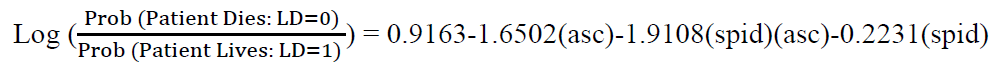
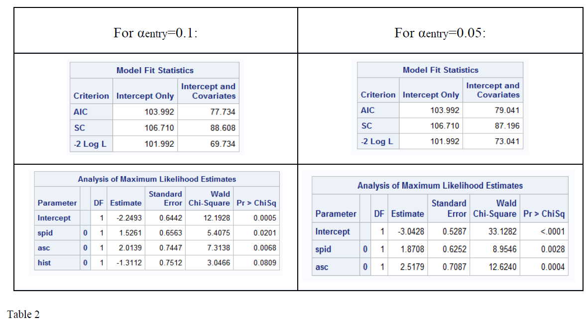
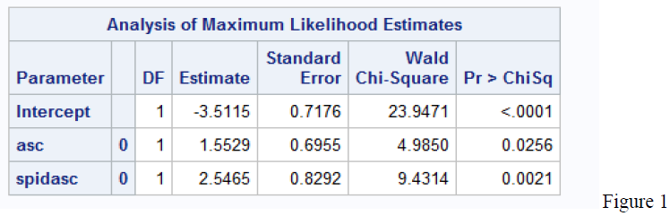
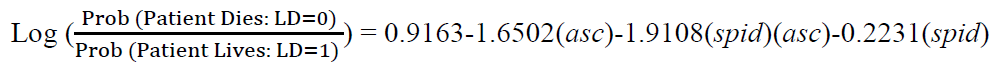

# Logistic Regression Model Report:

### Hepatitis Data Set

**Introduction :**

For this research paper, we will be studying the effects of various symptoms and tests which have the possibility to affect a patient&#39;s mortality due to hepatitis. We will be testing whether these effects can be used in a model to determine the probability of a given patient dying. There were 20 attributes in total in the data set; 19 independent variables and 1 dependent variable. Independent variables include both categorical as well as continuous variables. The response variable is categorical and represents whether the patient lives or dies. Statistical tests such as a correlation matrix, logistic regression modeling, and forward selection were used to test the hypothesis: determining which variables are significant and would be best to include in the model. Analysis between the independent variables (categorical and continuous) and their relation to the response variable was done through statistical tests in order to determine the best model to fit the data. In conclusion, our final model was defined as:

**Dataset Description :**

Hepatitis is defined to be the inflammation of the liver. Hepatitis can be caused by viruses and can lead to serious health consequences. There are several different forms of the virus, including types A, B, C, D, E, and G (1). Data retrieved from the UCI Machine Learning Repository: Hepatitis Data Set, donated by G. Gongfrom Carnegie-Mellon University 1988, studies how a variety independent symptoms and tests can affect a patient&#39;s mortality. In the data set, there is 155 observations and 20 variables in total. There are two types of independent variables; categorical and continuous. Categorical variables take the value zero or one, whereas continuous variables take the value of a rational number. There are 14 categorical variables as follows: mortality (which is the response variable), sex, steroid, antivirals, fatigue, malaise, anorexia, big liver, firm liver, spleen palpable, spiders, ascites, varices, and histology. There are six continuous variables which are age, bilirubin, alkaline phosphate, serum glutamic oxaloacetic transaminase, albumin, and prothrombin time. See table 1 below for important variable definitions:

| Variable | Value in SAS | Definition |
| --- | --- | --- |
| Live or Die (LD): Response Variable | LD=1, Patient LivesLD=0, Patient Dies | Whether the patient lives or dies. |
| Age | Numerical | The patient&#39;s age. |
| Antivirals (antiv) | Antiv=0 if No, Antiv=1 if Yes | Class of medication for viral infections which could impact the severity of Hepatitis. |
| Liver Big (livb) | Livb=0 if No, Livb=1 if Yes | Whether or not the liver is enlarged/ inflamed. |
| Liver Firm (livf) | Livf=0 if No, Livf=1 if Yes | Whether or not the liver is firm to touch. |
| Spleen Palpable (spleen) | Spleen=0 if No, Spleen=1 if Yes | The Spleen is located near the liver. If the liver is enlarged/ inflamed, it could affect whether the spleen is able to be felt. |
| Spiders (spid) | Spid=0 if No, Spid=1 if Yes | Collection of small blood vessels clustered very close to the surface of the skin. |
| Ascites (asc) | Asc=0 if No, Asc=1 if Yes | Accumulation of fluid in the abdominal region, leading to abdominal swelling |

Table 1

**METHOD :**

Among the six continuous variables, protime was excluded from our data set as 43% of the observations were missing. We believed this would make it difficult to adequately test the true effects of protime on the response variable, therefore it was removed.

The correlation matrix was used to decide whether or not an interaction term should be added into the model at the beginning. Following this, forward selection was run with two different αentry levels (0.1 and 0.05). This allowed us to determine which independent variables should be included in the final model as well as analyzing the SAS outputs to determine which αentry level is best to use. Furthermore, the Likelihood Ratio Test was used to decide which model from forward selection best fit the data. Interaction between the significant variables found using forward selection was tested to determine if the interaction term resulted in better predictions. Analysis of the classification table, which includes percentages false positives and false negatives from the models, is then used to determine which model best fits the data set. Due to nature of the model, data, underlying probabilities defined by false negatives or false positives, it is in our best interest as well as the best interest of the patients to minimize the percentage of false negatives.

**MODEL CREATION AND ANALYSIS :**

A Correlation Matrix was used to determine if there should be any interaction variables at the beginning of the selection process. The SAS output generated results having no correlation coefficient greater than the absolute value of 0.59; therefore multicollinearity was not an issue. Because of this fact, there were no interaction term added at the beginning of model selection.

Forward selection was used to decide which independent variables should be included in the final model. Two αentry levels were tested, 0.10 and 0.05, for the selection process. In order to determine which αentry level would give us the most accurate/ significant variables in the model, we used the Likelihood Ratio Test. Table 2 below outlines the SAS output.

For αentry=0.1, -2logL= 69.734 and the selection process identified three significant independent variables; _spid_, _asc_, and _hist_. For αentry=0.05, -2logL= 73.041 and the selection process identified two significant independent variables; _spid_ and _asc_.

The &#39;Complex Model&#39; from αentry=0.1 is given by:

**L1** = -2.2493+1.5261(_spid_)+2.0139(_asc_)-1.3112(_hist_)

The &#39;Simple Model&#39; from αentry=0.05 is given by:

**L0** = -3.0428+1.8708(_spid_)+2.5179(_asc_)

The Likelihood Ratio Test found below allows us to determine whether the coefficient of _hist_=0.

-2 Log LRT= -2Log L0- (-2Log L1) = 73.041-69.734= 3.307.

Since 3.307 is not significant for a Chi-Squared distribution with _df=1_, we cannot reject that the coefficient of _hist_=0. As a result, we found our &#39;Simple Model: L0&#39; from αentry=0.05 to be the best model to use.

Next, we analyzed the results of a model which included the interaction term of the variables _spid_ and _asc._ The quadratic terms of these variables are not needed as they are both categorical variables which take on the values 0 or 1 so, the quadratic terms would give the same variable values. When running a forward selection process with αentry=0.05, the results identified the interaction variable _spid_ x _asc= spidasc_ as significant.

We can therefore hypothesis that our final model should include the term _spidasc._

Classification tables were used to compare results of false negatives and false positives for our models. For this data set False Positive= Probability [model says patient dies | Patient lives] and False Negative= Probability [model says patient lives | Patient dies]. As previously stated, it is in the best interest of the Patients to minimize false negatives in order to prevent giving the Patient and their family a false hope of survival. The findings for each model are outlined below in table 3.

| **Model Variables** | **Cutoff Point** | **% Correct** | **% of False Pos.** | **% of False Neg.** |
| --- | --- | --- | --- | --- |
| Spid, Asc | 0.500 | 83.3 | 28.6 | 15.4 |
| Asc, SpidxAsc | 0.500 | 84.7 | 30.0 | 13.1 |
| Spid, Asc, SpidxAsc | 0.500 | 84.7 | 30.0 | 13.1 |

Table 3

As it can be seen, the models with the interaction term have a higher percentage correct, lower percentage of false negatives (which is desired), and only slightly higher percentage of false positives compared to the model without the interaction term.

**CONCLUSION :**

As a result, our final model will include the variables _spid_, _asc,_ and _spidasc_ where all 3 of the remaining variables are categorical_._ Through SAS, the final model was determined to be:

It can be seen that the coefficients of this model are significantly different from the model SAS found through forward selection when the interaction term was added (Figure 1). We believe this is because SAS found only _asc_ and _spidasc_ to be significant. When we had SAS keep the _spid_ term, the coefficients drastically changed to accommodate for the variable that forward selection did not keep and did not find significant in the model. The model still however gave a higher percentage correct and a lower percentage of false negatives (Table 3) compared to the model with only _spid_ and _asc_ which makes this model the best fit for the data.

#
_(1) Public Health Agency of Canada_. Hepatitis, 2015, http://www.phac-aspc.gc.ca/hep/index-eng.php
